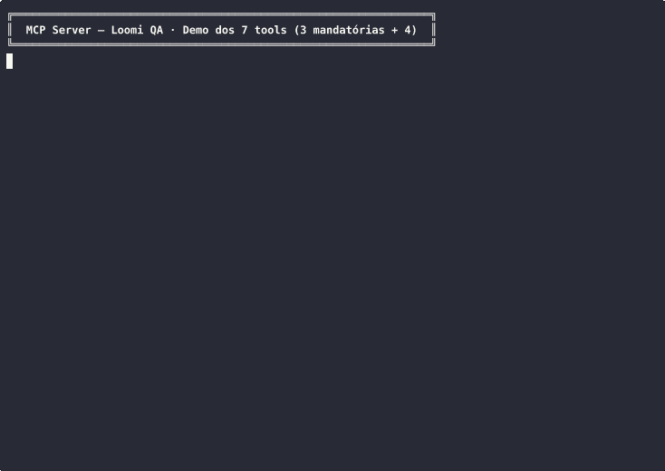

# Tutorial MCP Server — Loomi QA

Este servidor MCP **expõe a suíte de testes Playwright como tools que uma IA (LLM) pode invocar**. Reproduzível em ≤5min sem instalar nada além de Node 20+.

## 🎬 Demos visuais

### Terminal demo — 7 tools MCP rodando (sem Claude Desktop)



`bash scripts/demo-mcp.sh` exercita `tools/list`, `resources/list`, `list_test_cases`, `get_test_history` + Vitest (31 testes). Tudo via stdio JSON-RPC.

### Browser demo — Playwright real navegando kasa.live (cliente do MCP)

O servidor MCP usa Playwright como engine. Aqui o `run_test_case` em ação contra **https://www.kasa.live** (rede real, sem mocks):

| Cenário                                                       | Vídeo                                                            |
| ------------------------------------------------------------- | ---------------------------------------------------------------- |
| **Click em card de partida → modal abre**                     |     |
| **Filtro "Qual time?" → typeahead dispara `/team/?name=...`** |  |

Vídeos `.webm` originais também em `docs/site-snapshots/mcp/playwright-*.webm` (qualidade superior, mesmo conteúdo). Esses vídeos foram capturados com `playwright test --config=temp-config-com-video=on` durante a execução real do smoke suite contra `kasa.live`.

**Como reproduzir:**

```bash
# Terminal demo
bash scripts/demo-mcp.sh

# Browser demo (com video=on)
npm run test:smoke -- --video=on
# vídeos vão pra test-results/<test-name>/video.webm
```

---

## O que é MCP (contexto rápido)

**Model Context Protocol** é um padrão da Anthropic (open source) que permite a um modelo de linguagem (Claude, GPT, etc.) chamar funções de servidores externos via JSON-RPC sobre stdio. Pense em "API REST para LLMs". Ver: https://modelcontextprotocol.io

Aqui, o cliente MCP (Claude Desktop, Cursor, ou qualquer cliente compatível) conecta no nosso servidor `loomi-qa` e ganha acesso a 7 tools:

- 3 mandatórias do desafio: `run_test_case`, `get_element_status`, e Resources de erro
- 4 extras: `navigate_to`, `list_test_cases`, `get_test_history`, `extract_dom_snapshot`, `analyze_failure`

Não precisa de Claude Desktop pra testar — o passo 3 abaixo mostra como validar via `echo`/stdio sem instalar nada.

---

## 1. Setup (≤2min)

```bash
git clone https://github.com/filipeCardorso/loomi-qa-challenge-kasa.git
cd loomi-qa-challenge-kasa
nvm use            # ou: usar Node 20+ manualmente
npm install        # ~30s, popula workspaces (root + mcp-server)
npx playwright install chromium
npm run mcp:build  # compila TS pro mcp-server/dist/
```

**Pré-requisitos:** Node ≥ 20, npm ≥ 10. macOS/Linux/WSL (Windows nativo funciona mas paths abaixo mudam).

---

## 2. Validação RÁPIDA via stdio (sem Claude Desktop) — recomendado primeiro

Confirma que o servidor responde JSON-RPC corretamente:

```bash
echo '{"jsonrpc":"2.0","id":1,"method":"tools/list"}' | node mcp-server/dist/index.js
```

**Saída esperada** (truncada):

```json
{
  "result": {
    "tools": [
      { "name": "run_test_case", "description": "Executa um teste Playwright filtrado..." },
      { "name": "get_element_status", "description": "Retorna estado completo de um elemento..." },
      { "name": "navigate_to", "description": "Navega o browser persistente..." },
      { "name": "list_test_cases", "description": "..." },
      { "name": "get_test_history", "description": "..." },
      { "name": "extract_dom_snapshot", "description": "..." },
      { "name": "analyze_failure", "description": "..." }
    ]
  },
  "jsonrpc": "2.0",
  "id": 1
}
```

7 tools listados → servidor OK. Se não aparecer, ver Troubleshooting (§7).

Validar Resources:

```bash
echo '{"jsonrpc":"2.0","id":1,"method":"resources/list"}' | node mcp-server/dist/index.js
```

Saída esperada: `{"result":{"resources":[]}, ...}` (registry inicia vazio; resources são populados após falhas em `run_test_case`).

Validar Vitest dos próprios tools (31 testes):

```bash
npm test --workspace=mcp-server
```

Esperado: `Tests  31 passed (31)` em ~300ms.

---

## 3. Configurar Claude Desktop (opcional — recomendado pra demo visual)

Se quiser ver a IA interagindo com o MCP de forma natural:

**macOS:** edita `~/Library/Application Support/Claude/claude_desktop_config.json`
**Linux:** `~/.config/Claude/claude_desktop_config.json`
**Windows:** `%APPDATA%\Claude\claude_desktop_config.json`

```json
{
  "mcpServers": {
    "loomi-qa": {
      "command": "node",
      "args": ["/CAMINHO/ABSOLUTO/loomi-qa-challenge-kasa/mcp-server/dist/index.js"]
    }
  }
}
```

⚠️ Substitua `/CAMINHO/ABSOLUTO/...` pelo caminho real (ex: `/Users/seuuser/loomi-qa-challenge-kasa/mcp-server/dist/index.js`).

Salvar e **fechar Claude completamente** (Cmd+Q no Mac, não só fechar janela) e reabrir.

Em um chat novo: ícone de plugin no canto inferior direito do input deve mostrar `loomi-qa` listado.

Pergunta de teste:

> "Quais tools você tem do servidor loomi-qa?"

Resposta esperada: lista os 7 tools.

---

## 4. Três prompts de exemplo (para Claude Desktop)

### Prompt 1 — Descobrir e rodar (cobre `list_test_cases` + `run_test_case`)

> "Liste os casos de teste disponíveis no loomi-qa e rode o smoke test. Me mostre o resultado em formato resumido."

Fluxo esperado: invoca `list_test_cases` (retorna ~46 testes com tags), depois `run_test_case({ name: '@smoke' })` retornando `{ status: 'passed', duration_ms: ~17000, testId: '...' }`.

### Prompt 2 — Analisar falha (cobre Resources + `analyze_failure`)

> "Rode o teste 'busca-time' (que pode falhar por timeout do site DEV). Se falhar, leia o screenshot e o trace via resources, e use analyze_failure no testId pra me dizer a causa raiz."

Fluxo esperado:

1. `run_test_case({ name: 'busca-time' })` → pode falhar
2. Resources expostos: `loomi://artifacts/{testId}/screenshot.png`, `trace.zip`, `error.log`
3. Cliente lê os resources (LLM pode ver o screenshot via image content)
4. `analyze_failure({ testId })` → retorna `{ hypothesis: "provável timeout em waitFor", relatedArtifacts, similarPastFailures }`

### Prompt 3 — Exploração ao vivo (cobre `navigate_to` + `get_element_status` + `extract_dom_snapshot`)

> "Use navigate_to para ir em https://www.kasa.live/, depois use get_element_status pra me dizer o estado do botão 'Entrar'. Em seguida, capture um snapshot aria-tree do header."

Fluxo:

1. `navigate_to({ url: 'https://www.kasa.live/' })` → retorna `{ ok: true, finalUrl }`
2. `get_element_status({ selector: 'button:has-text("Entrar")' })` → `{ exists: true, visible: true, enabled: true, text: 'Entrar', boundingBox: {...}, ariaRole: ... }`
3. `extract_dom_snapshot({ selector: 'header', format: 'aria-tree' })` → árvore acessibilidade do header

---

## 5. Catálogo de tools

| Tool                   | Mandatória? | Input                                        | Saída                                                                    |
| ---------------------- | ----------- | -------------------------------------------- | ------------------------------------------------------------------------ |
| `run_test_case`        | ✅ Sim      | `{ name, browser?, headed? }`                | `{ status, duration_ms, errors, artifacts, testId }`                     |
| `get_element_status`   | ✅ Sim      | `{ selector, url?, timeoutMs? }`             | `{ exists, visible, enabled, text, boundingBox, attributes, ariaRole }`  |
| `navigate_to`          | Extra       | `{ url }`                                    | `{ ok, finalUrl }`                                                       |
| `list_test_cases`      | Extra       | `{ dir? }`                                   | `{ total, tests: [{ name, file, tags }] }`                               |
| `get_test_history`     | Extra       | `{ name?, limit? }`                          | `{ total, runs: [{ testId, name, status, duration_ms, timestamp }] }`    |
| `extract_dom_snapshot` | Extra       | `{ selector?, format: 'html'\|'aria-tree' }` | `{ format, snapshot, length }`                                           |
| `analyze_failure`      | Extra       | `{ testId }`                                 | `{ hypothesis, matchedPatterns, relatedArtifacts, similarPastFailures }` |

---

## 6. Resources (artefatos de erro)

Quando `run_test_case` falha, o servidor registra dinamicamente os artefatos do Playwright como Resources MCP, com URI estável:

```
loomi://artifacts/{testId}/screenshot.png   (image/png)
loomi://artifacts/{testId}/video.mp4        (video/mp4)
loomi://artifacts/{testId}/trace.zip        (application/zip — Playwright trace)
loomi://artifacts/{testId}/error.log        (text/plain)
loomi://artifacts/{testId}/console.log      (text/plain)
loomi://artifacts/{testId}/network.har      (application/json)
loomi://artifacts/{testId}/dom.html         (text/html)
```

Após cada falha, o servidor envia notificação `notifications/resources/list_changed` para clientes conectados. Resources são lidos via método MCP padrão `resources/read?uri=...`.

Isso atende ao requisito: **"Se um teste falhar, o MCP deve expor o log de erro ou o screenshot do erro como um Resource para que a IA possa analisar a causa raiz"**.

---

## 7. Troubleshooting

| Problema                                        | Solução                                                                                                                  |
| ----------------------------------------------- | ------------------------------------------------------------------------------------------------------------------------ |
| `vitest: command not found`                     | Rodar `npm install` na raiz do projeto (não dentro de `mcp-server/`) — workspaces hoist deps na raiz                     |
| Plugin `loomi-qa` não aparece no Claude Desktop | (1) Cmd+Q completo, não só fechar janela. (2) Path em `args` é absoluto? (3) Build foi feito? `npm run mcp:build`        |
| `ENOENT spawn npx`                              | `which npx` está vazio? Adicione Node ao PATH ou use caminho absoluto `node /usr/local/bin/npx ...` no spawn             |
| Build TypeScript falha                          | Verifique `node -v` ≥ 20 e que `npm install` rodou na raiz                                                               |
| `run_test_case` nunca termina                   | Playwright roda contra `kasa.live` (pode ter latência DEV). Tente `headed: true` para inspeção visual                    |
| `analyze_failure` retorna "Nenhum registro"     | testId nunca falhou; falha é gravada em `mcp-server/data/failures/{testId}.json` apenas após uma execução real que falhe |
| Logs detalhados                                 | `mcp-server/logs/mcp-YYYY-MM-DD.jsonl` (toda chamada) e `mcp-server/data/history.jsonl` (histórico de runs)              |

---

## 8. Estrutura do código

```
mcp-server/
├── src/
│   ├── index.ts              # Bootstrap servidor + wire de tools/resources
│   ├── tools/                # 1 arquivo por tool (7 arquivos)
│   ├── runner/
│   │   ├── playwrightBridge.ts   # spawn `npx playwright test`
│   │   ├── liveBrowser.ts        # chromium persistente p/ get_element_status + navigate_to
│   │   └── resultParser.ts       # parse JSON do reporter Playwright
│   ├── resources/
│   │   └── registry.ts       # registra/lista/lê artefatos como MCP Resources
│   └── types/
│       └── mcp.ts            # Zod schemas compartilhados
├── tests/                    # 31 testes Vitest (≥80% coverage handlers)
│   ├── resources/
│   │   └── registry.test.ts  (4 testes)
│   └── tools/
│       ├── runTestCase.test.ts        (4)
│       ├── getElementStatus.test.ts   (3)
│       ├── listTestCases.test.ts      (5)
│       ├── getTestHistory.test.ts     (6)
│       └── analyzeFailure.test.ts     (9)
├── data/                     # gerado em runtime (history.jsonl, failures/)
├── logs/                     # gerado em runtime (mcp-YYYY-MM-DD.jsonl)
└── package.json
```

---

## 9. Decisões arquiteturais (deep-dive)

- **Single-flight `TestRunner`**: `run_test_case` serializa execuções via mutex FIFO. Não há pool de runners — simplicidade > paralelismo dado o caso de uso (1 LLM cliente por sessão).
- **`LiveBrowser` separado**: chromium persistente para `get_element_status`/`navigate_to` é independente do test runner (que spawna seu próprio Playwright efêmero). Isso evita poluir contexto de testes com state do exploration.
- **Resources dinâmicos**: registry é populado on-failure, não pre-declarado. URI scheme `loomi://` é custom (não confunde com `file://` real).
- **stdio transport**: padrão Claude Desktop / IDE plugins. Não há HTTP — sem porta/auth/CORS.
- **Heurística simples em `analyze_failure`**: regex sobre stack traces (TimeoutError, "is not visible", "expect(...).toBe", "net::ERR"). Sem ML — explicabilidade > acurácia.

---

## 10. Verificar que tudo funciona em uma linha

```bash
git clone https://github.com/filipeCardorso/loomi-qa-challenge-kasa.git && \
cd loomi-qa-challenge-kasa && \
npm install && \
npm run mcp:build && \
echo '{"jsonrpc":"2.0","id":1,"method":"tools/list"}' | node mcp-server/dist/index.js | grep -c '"name":' && \
npm test --workspace=mcp-server
```

Saída esperada: 7 (tools) e 31 testes Vitest verdes.
